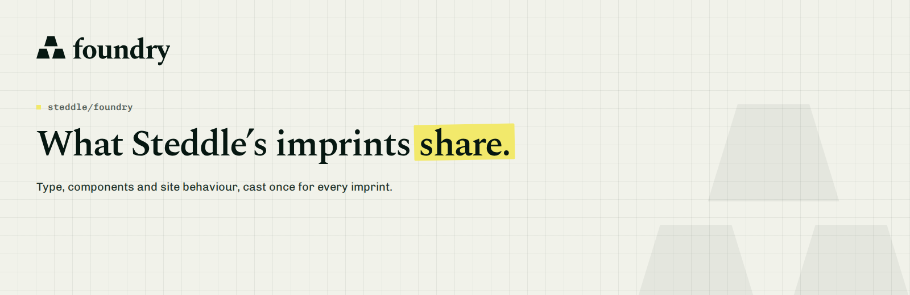

<picture>
  <source media="(prefers-color-scheme: dark)" srcset="art/readme-banner-dark.png">
  
</picture>

# Foundry

What Steddle's imprints share: type, components and site behaviour.

steddle, bron and sendnda are imprints of one house. Foundry holds what they have in common: the type scale, the colour ramps, the Blade components every page is built from, the lab that shows them, and the rendering of each imprint's own images. A site keeps its content and its two colour ramps. Everything else comes from here.

## Installation

```json
"repositories": [{ "name": "foundry", "type": "vcs", "url": "https://github.com/steddle/foundry" }]
```

```bash
composer require steddle/foundry:dev-main
```

The service provider registers itself.

### Requires

- PHP 8.3+, Laravel 13
- Flux and Flux Pro 2.20+, Tailwind 4
- `playwright` as a devDependency, for `foundry:assets`

## Quick start

Import the stylesheet after Tailwind and Flux:

```css
@import '../../vendor/steddle/foundry/resources/css/foundry.css';
```

Give the imprint its `config/imprint.php` (name, ink and paper, scenes, og and banner copy), its `x-site.lockup`, `x-site.mark` and `x-site.marker`, and its `zinc` and `primary` ramps. Then build a page:

```blade
<x-site.hero title="What the page is for." marked="for." lead="One sentence under it." />
<x-site.section>…</x-site.section>
<x-site.footer />
```

Outside production, `/components` shows every component the imprint renders, live and as Blade.

## Features

- Spectral, Chivo and Chivo Mono, the type scale and the radii in `foundry.css`
- Seven ramps, written out as pairs: no role tokens
- Layout, hero, section, nav and footer components under `x-site.*`, overridable per site
- `/labs`, `/design` and `/components` outside production
- `php artisan foundry:assets` renders the OG image, the social preview, the README banners and the icons, and `--check` fails when they drift from the copy
- Markdown for agents: every page answers as markdown at `.md`, chrome left out

## Documentation

The rules every imprint follows live in [`resources/boost/guidelines/core.blade.php`](resources/boost/guidelines/core.blade.php), which Laravel Boost renders into each site's `CLAUDE.md`.

The mark, lockups and banners are in [`art/`](art).

## License

MIT. See [LICENSE](LICENSE).
