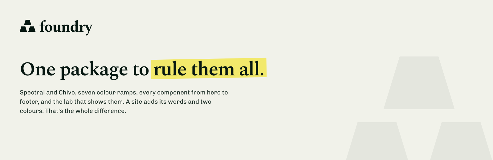

<picture>
  <source media="(prefers-color-scheme: dark)" srcset="workbench/public/brand/social/readme-banner-dark.png">
  
</picture>

# Foundry

What Steddle's imprints share: type, components and site behaviour.

Every Steddle site is an imprint of one house. Foundry holds what they have in common: the type scale, the colour ramps, the Blade components every page is built from, the lab that shows them, and the rendering of each imprint's own images. A site keeps its content and its two colour ramps. Everything else comes from here.

## Installation

```json
"repositories": [{ "name": "foundry", "type": "vcs", "url": "https://github.com/steddle/foundry" }]
```

```bash
composer require steddle/foundry:dev-main
```

The service provider registers itself.

### Requires

- PHP 8.3+, Laravel 13
- Flux and Flux Pro 2.20+, Tailwind 4
- `playwright` as a devDependency, for `foundry:assets`
- `puppeteer` where Browsershot finds it, for printing PDFs

## Quick start

Import the stylesheet after Tailwind and Flux:

```css
@import '../../vendor/steddle/foundry/resources/css/foundry.css';
```

Then give the imprint what is its own:

- `config/imprint.php`: name, ink and paper, scenes (`docs-hero` and `legal-hero` where it has docs and legal pages), og and banner copy, and `locales` where it speaks more than one language
- `resources/views/layouts/site.blade.php`, wrapping `<foundry:layouts.site>` and handing `<foundry:footer>` its links and its `scene`
- `foundry:lockup`, `foundry:mark` and `foundry:bar`, the bar over every page, which sets `<foundry:header>` with the site's links, its actions and, for a signed-in reader, the account menu; and its `zinc` and `primary` ramps
- Its words for the error pages, in `lang/vendor/foundry/{locale}/errors.php`, and their scene under `errors.scene` in `config/imprint.php`
- `config/markdown-response.php` naming `Steddle\Foundry\Markdown\DetectsMarkdownRequest` and `RemoveMarkdownSkipPreprocessor`, with `ProvideMarkdownResponse` on its public routes

The layout:

```blade
@props(['title', 'description'])

<foundry:layouts.site :$title :$description :og="$og ?? []">
    {{ $slot }}
    <x-slot:closing>{{ $closing ?? '' }}</x-slot:closing>
</foundry:layouts.site>
```

A page:

```blade
<x-layouts::site title="Pricing" description="What it costs.">
    <foundry:sections.hero scene="hero" title="What the page is for." marked="for." lead="One sentence under it." />
    <foundry:section>…</foundry:section>
</x-layouts::site>
```

Outside production, `/components` shows every component the imprint renders, live and as Blade.

## Features

- Spectral, Chivo and Chivo Mono, the type scale and the radii in `foundry.css`
- Seven ramps, written out as pairs: no role tokens
- Layout, nav and footer components under `foundry:*`, and the base sections a page is built from under `foundry:sections.*`, overridable per site
- Languages: every page per locale under `Route::localized()`, translated paths, the language switch and the visitor's language followed
- Docs and legal pages from a table of contents, with `Route::docs()` and `Route::legal()`
- `sitemap.xml`, `llms.txt` and `llms-full.txt` from the imprint's page list
- The app shell for signed-in pages: `foundry:layouts.app` under the site's own bar, the band each page opens on, the account menu, page head, record rows, empty state and settings rows
- Error pages for 403, 404, 419, 429, 500 and 503, in the imprint's words and on its scene
- `/labs`, `/design` and `/components` outside production
- `php artisan foundry:assets` renders the OG image, the social preview, the README banners and the icons, and `--check` fails when they drift from the copy
- Markdown for agents: every page answers as markdown at `.md`, chrome left out
- Printed documents: `Printer` makes a PDF from a page of the imprint's own, set with `foundry:print.*` on A4 or Letter, fonts and all held in the stored HTML

## What it takes over

The foundry owns `foundry:*` in every imprint. A file of that name under `resources/views/foundry` stands in for the foundry's component, as a published Flux component stands in for its own. A component of the imprint's own lives under `resources/views/components` and is written `<x-name>`.

An imprint in more than one language (`imprint.locales`) gets `FollowPreferredLocale` pushed onto its `web` middleware group and the locale cookie left unencrypted, so a page that states no language speaks the visitor's.

## Documentation

The rules every imprint follows live in [`resources/boost/guidelines/core.blade.php`](resources/boost/guidelines/core.blade.php), which Laravel Boost renders into each site's `CLAUDE.md`.

Foundry renders its own banners, social preview and icons as an imprint would, from [`workbench/`](workbench): `npm run build`, `vendor/bin/testbench serve --port=8765`, then `vendor/bin/testbench foundry:assets --url=http://127.0.0.1:8765`. The mark and lockups are in [`workbench/public/brand/logos`](workbench/public/brand/logos).

## License

MIT. See [LICENSE](LICENSE).
